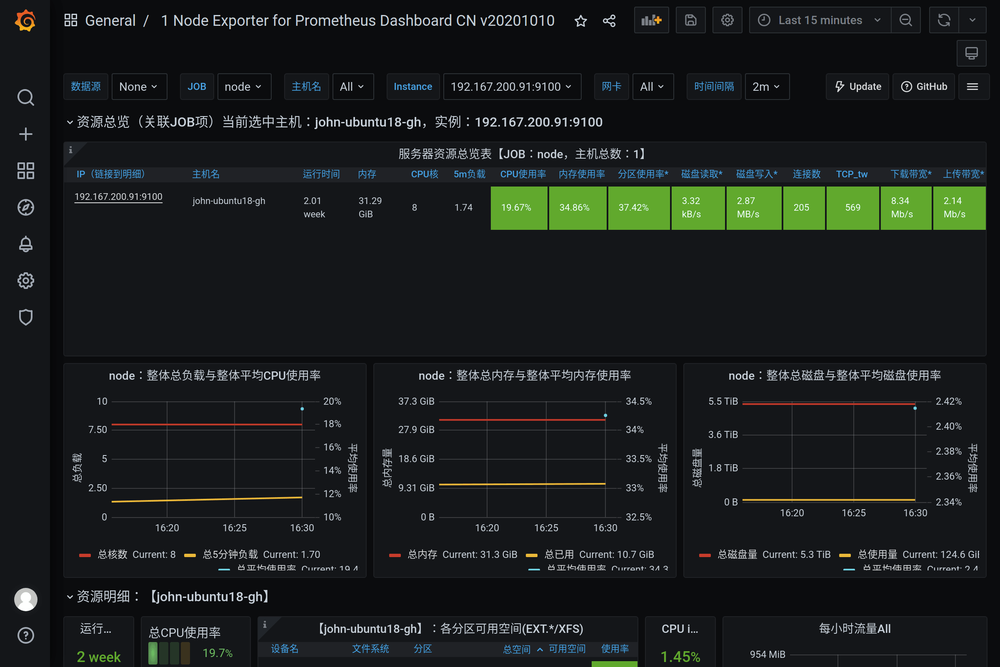

# Start [Prometheus][]

[Prometheus]: https://github.com/prometheus/
[Grafana]: https://github.com/grafana/

- [Prometheus Docs](https://prometheus.io/docs/)
  - [Configuration](https://prometheus.io/docs/prometheus/latest/configuration/configuration/)
  - [Node Exporter](https://github.com/prometheus/node_exporter)
  - [DCGM Exporter](https://github.com/NVIDIA/gpu-monitoring-tools#dcgm-exporter)
- [Grafana Docs](https://grafana.com/docs/grafana/latest/)
  - [Dashboards](https://grafana.com/grafana/dashboards)
  - [Plugins](https://grafana.com/grafana/plugins/)

## Prerequisites

- [Docker](https://docs.docker.com/)

## Client

### Node Exporter

Exporter for machine (*NIX kernels) metrics, [download here](https://prometheus.io/download/#node_exporter) and extract it:

```bash
wget https://github.com/prometheus/node_exporter/releases/download/v1.1.2/node_exporter-1.1.2.linux-amd64.tar.gz
tar xvfz node_exporter-1.1.2.linux-amd64.tar.gz
cd node_exporter-1.1.2.linux-amd64
nohup ./node_exporter &
```

See metrics:

```bash
$ curl http://localhost:9100/metrics
# HELP go_gc_duration_seconds A summary of the pause duration of garbage collection cycles.
# TYPE go_gc_duration_seconds summary
go_gc_duration_seconds{quantile="0"} 0
go_gc_duration_seconds{quantile="0.25"} 0
go_gc_duration_seconds{quantile="0.5"} 0
...
```

### DCGM Exporter

Exporter for NVIDIA GPU metrics, run using [Docker image](https://hub.docker.com/r/nvidia/dcgm-exporter):

```bash
docker run -d --restart=always --gpus all -p 9400:9400 nvidia/dcgm-exporter
```

See metrics:

```bash
$ curl localhost:9400/metrics
# HELP DCGM_FI_DEV_SM_CLOCK SM clock frequency (in MHz).
# TYPE DCGM_FI_DEV_SM_CLOCK gauge
# HELP DCGM_FI_DEV_MEM_CLOCK Memory clock frequency (in MHz).
# TYPE DCGM_FI_DEV_MEM_CLOCK gauge
# HELP DCGM_FI_DEV_MEMORY_TEMP Memory temperature (in C).
...
```

## Server

### Prometheus

Config `~/prometheus.yml`:

```yml
global:
  scrape_interval: 15s

scrape_configs:
# Node Exporter
- job_name: node
  static_configs:
  - targets: ['192.167.200.91:9100']
# DCGM Exporter
- job_name: dcgm
  static_configs:
  - targets: ['192.167.200.91:9400']
```

Run using Docker image:

```bash
docker run -d --restart=always \
-p 9090:9090 \
-v ~/prometheus.yml:/etc/prometheus/prometheus.yml \
prom/prometheus
```

Visit http://localhost:9090/ :


Visit http://localhost:9090/targets :


### Grafana

Run using Docker image:

```bash
docker run -d --restart=always -p 3000:3000 grafana/grafana
```

Visit http://localhost:3000/ :


Login with `admin/admin`.

#### Add data source


Add `Prometheus`:


`Save & Test`:


#### Import Dashboard


Import `8919` [Node Exporter for Prometheus Dashboard by StarsL.cn](https://grafana.com/grafana/dashboards/8919):


See dashboard:



Import `12239` [NVIDIA DCGM Exporter Dashboard by nvidia](https://grafana.com/grafana/dashboards/12239):


See dashboard:


